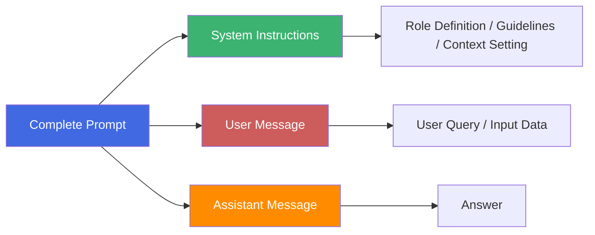

## Prompt Components
> A prompt is composed of multiple components that guide the AI model's behavior and response generation.

```mermaid
flowchart LR
    A[Complete Prompt]

    A --> B[System Instructions]
    A --> C[User Message]
    A --> D[Assistant Message]

    B --> B1[Role Definition / Guidelines / Context Setting]
    C --> C1[User Query / Input Data ]
    D --> D1[Answer]

    style A fill:#4169e1,color:#fff
    style B fill:#3cb371,color:#fff
    style C fill:#cd5c5c,color:#fff
    style D fill:#ff8c00,color:#fff
```
