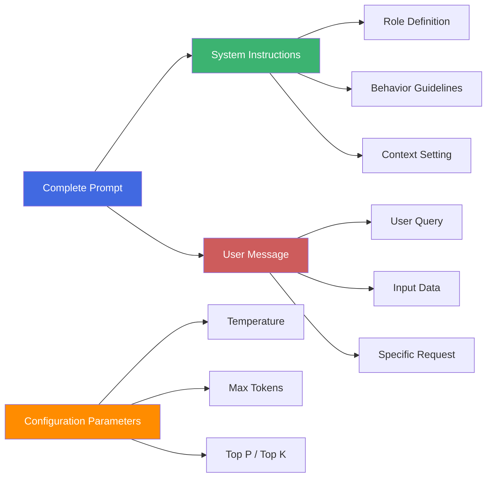
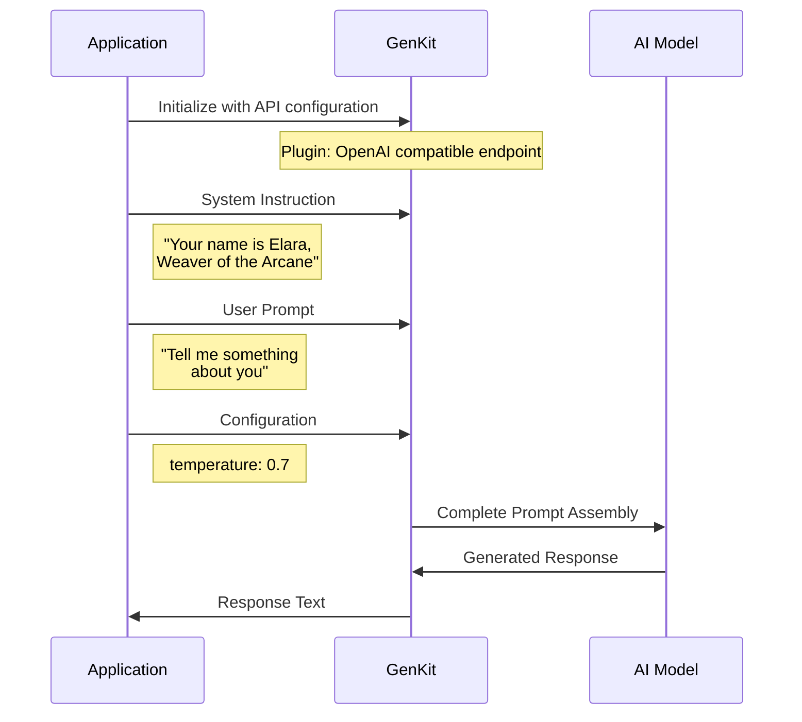
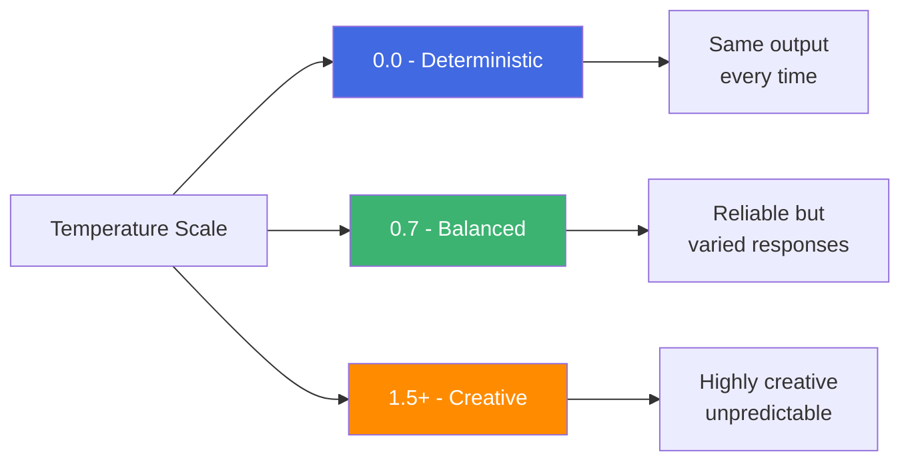
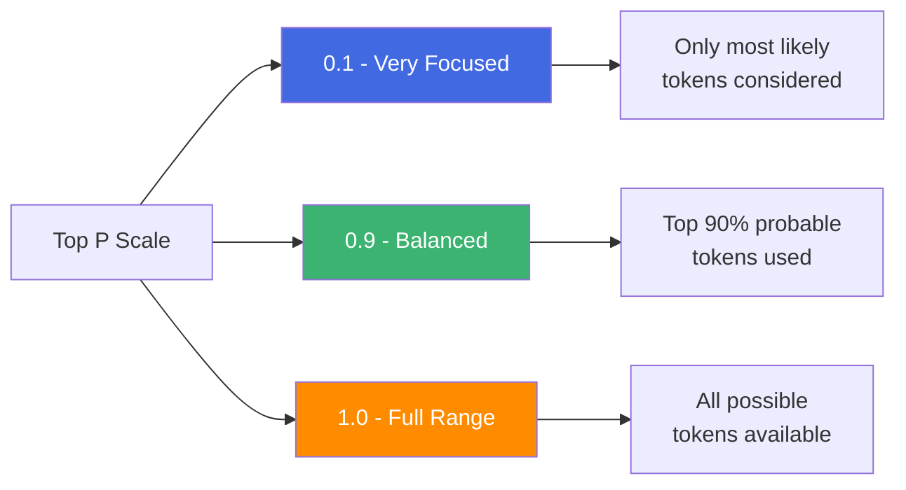

<style>
.dodgerblue {
  color: dodgerblue;
}
.indianred {
  color: indianred;
}
.seagreen {
  color: seagreen;
}
</style>

### Understanding Prompt Anatomy

A prompt is composed of multiple components that guide the AI model's behavior and response generation.

---

### Prompt Components Architecture



---

### Prompt Flow in GenKit



---

### GenKit Example Breakdown

```golang
resp, err := genkit.Generate(ctx, g,
    // 🎯 Model Selection
    ai.WithModelName("openai/ai/qwen2.5:latest"),

    // 🤖 System Instructions (AI Identity & Behavior)
    ai.WithSystem("Your name is Elara, Weaver of the Arcane."),

    // 💬 User Message (The Actual Query)
    ai.WithPrompt("Tell me something about you"),

    // ⚙️ Configuration Parameters (Response Control)
    ai.WithConfig(map[string]any{"temperature": 0.7}),
)
```

---

### Component Details

| Component | Purpose | Example |
|-----------|---------|---------|
| **System Instructions** | Define AI personality, role, and constraints | "You are a helpful assistant" |
| **User Message** | The actual question or task | "Explain quantum computing" |
| **Temperature** | Control randomness (0.0-2.0) | 0.7 = balanced creativity |
| **Model Name** | Which AI model to use | qwen2.5:latest |
| **Context** | Previous conversation history | Prior messages in chat |

---

### Temperature Impact



---

### Top P Impact



**Top P (Nucleus Sampling)**: Controls diversity by limiting token selection to the top cumulative probability mass.

- **Low (0.1-0.3)**: Only the most probable tokens → More focused, coherent output
- **Medium (0.5-0.9)**: Balanced selection → Natural, varied responses
- **High (0.95-1.0)**: Nearly all tokens considered → Maximum diversity

💡 **Tip**: Top P and Temperature work together. Use Top P for controlling vocabulary breadth while Temperature controls randomness.

---

### Best Practices

✅ **System Instructions**: Set clear role and behavioral guidelines
✅ **User Message**: Be specific and provide context
✅ **Temperature**:
   - Low (0.0-0.3) for factual, consistent outputs
   - Medium (0.4-0.8) for balanced responses
   - High (0.9-2.0) for creative content

⚠️ **Remember**: Prompt engineering is iterative - test and refine!

