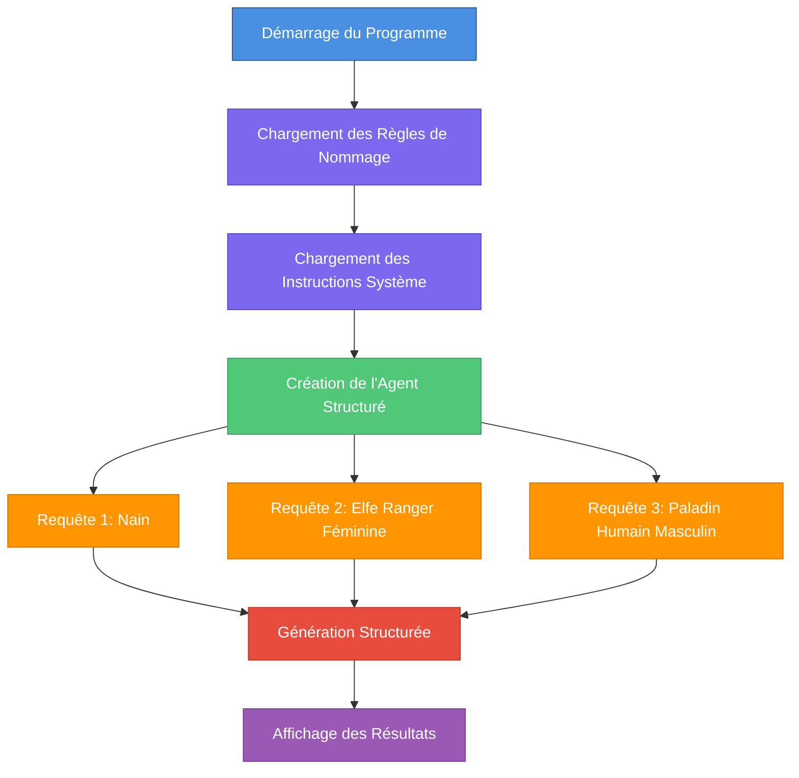

# Générateur de Personnages NPC pour D&D

## Description

Ce programme génère automatiquement des personnages non-joueurs (NPC) pour Donjons & Dragons en utilisant un agent IA structuré basé sur le framework Nova SDK.

## Fonctionnement

Le programme crée un agent IA capable de générer des personnages D&D avec des informations structurées :
- **Prénom** et **Nom de famille** respectant les conventions de la race
- **Race** (Nain, Elfe, Humain)
- **Classe** (Guerrier, Mage, Rôdeur, Clerc, Voleur, Paladin, etc.)
- **Genre** (masculin/féminin)

### Architecture



## Composants Principaux

### 1. Structure de Données
```go
type NPCCharacter struct {
    FirstName  string  // Prénom
    FamilyName string  // Nom de famille
    Race       string  // Race (Dwarf/Elf/Human)
    Class      string  // Classe D&D
    Gender     string  // Genre (male/female)
}
```

### 2. Base de Connaissances
- **Règles de nommage** (`dnd.naming.rules.md`) : Conventions de noms par race
- **Instructions système** (`dnd.system.instructions.md`) : Directives pour l'IA

### 3. Agent IA
- Agent Nova de type **structured** : `structured.NewAgent`
- Utilise le type `NPCCharacter` pour la génération structurée
- Utilise le modèle `nvidia_nemotron-mini-4b-instruct`
- Configuration créative (`temperature: 0.7`, `topP: 0.9`, `topK: 40`)
- Génère des sorties structurées au format JSON

## Flux d'Exécution

1. **Initialisation**
   - Lecture des règles de nommage D&D
   - Injection des règles dans les instructions système

2. **Création de l'Agent**
   - Configuration du modèle LLM
   - Définition du schéma de sortie structuré

3. **Génération des Personnages**
   - Traite 3 cas de test différents
   - Chaque requête génère un personnage complet
   - Affiche les résultats formatés

## Exemple de Sortie

```
🎲 Request 1: Generate a dwarf character
🔄 Generating NPC...

🧙 Generated NPC Summary:
Name       : Thorin Ironforge
Race       : Dwarf
Class      : Warrior
Gender     : male
```

## Technologies Utilisées

- **Langage** : Go
- **Framework** : Nova SDK
- **Modèle IA** : Nemotron Mini 4B (quantisé Q4_K_M)
- **Moteur** : Docker Model Runner avec endpoint llama.cpp (`http://localhost:12434/engines/llama.cpp/v1`)

## Exécution

```bash
go run main.go
```

Le programme génère automatiquement 3 personnages de test et affiche leurs caractéristiques.
