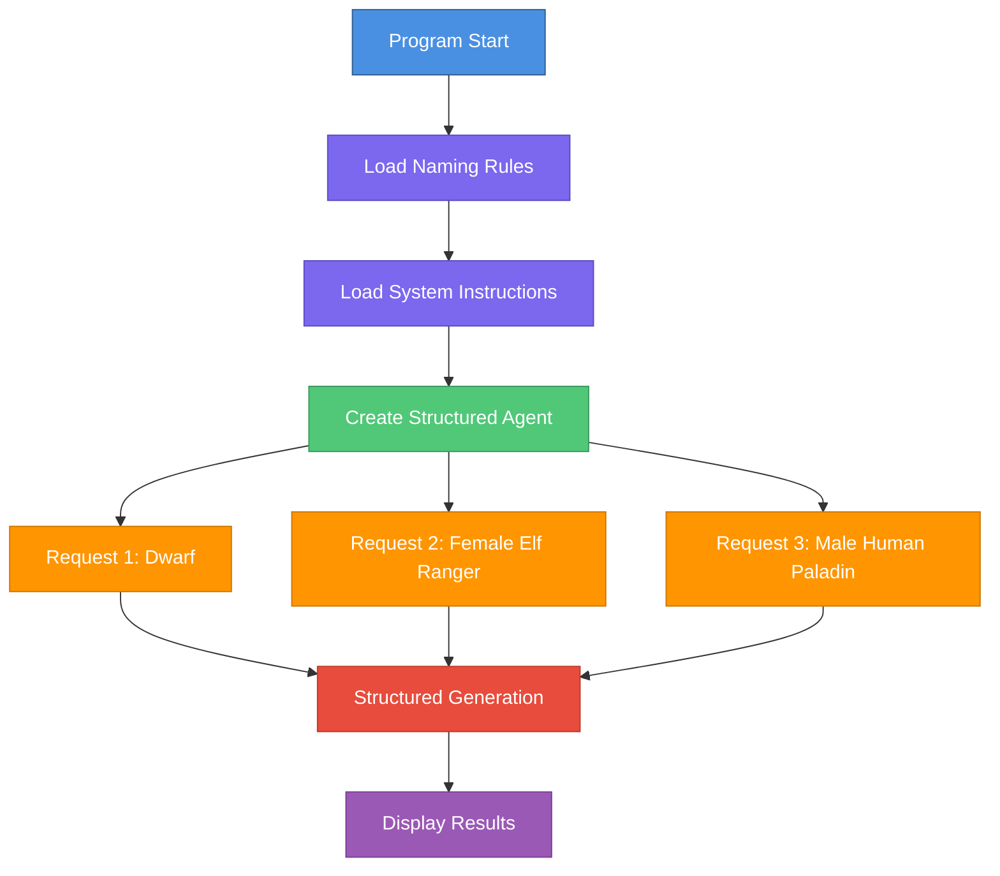

# D&D NPC Character Generator

## Description

This program automatically generates non-player characters (NPCs) for Dungeons & Dragons using a structured AI agent based on the Nova SDK framework.

## How It Works

The program creates an AI agent capable of generating D&D characters with structured information:
- **First Name** and **Family Name** following race conventions
- **Race** (Dwarf, Elf, Human)
- **Class** (Warrior, Mage, Ranger, Cleric, Rogue, Paladin, etc.)
- **Gender** (male/female)

### Architecture



## Main Components

### 1. Data Structure
```go
type NPCCharacter struct {
    FirstName  string  // First name
    FamilyName string  // Family name
    Race       string  // Race (Dwarf/Elf/Human)
    Class      string  // D&D class
    Gender     string  // Gender (male/female)
}
```

### 2. Knowledge Base
- **Naming rules** (`dnd.naming.rules.md`): Name conventions by race
- **System instructions** (`dnd.system.instructions.md`): Directives for the AI

### 3. AI Agent
- Nova agent of type **structured**: `structured.NewAgent`
- Uses the `NPCCharacter` type for structured generation
- Uses the `nvidia_nemotron-mini-4b-instruct` model
- Creative configuration (`temperature: 0.7`, `topP: 0.9`, `topK: 40`)
- Generates structured output in JSON format

## Execution Flow

1. **Initialization**
   - Read D&D naming rules
   - Inject rules into system instructions

2. **Agent Creation**
   - Configure the LLM model
   - Define the structured output schema

3. **Character Generation**
   - Process 3 different test cases
   - Each request generates a complete character
   - Display formatted results

## Output Example

```
🎲 Request 1: Generate a dwarf character
🔄 Generating NPC...

🧙 Generated NPC Summary:
Name       : Thorin Ironforge
Race       : Dwarf
Class      : Warrior
Gender     : male
```

## Technologies Used

- **Language**: Go
- **Framework**: Nova SDK
- **AI Model**: Nemotron Mini 4B (quantized Q4_K_M)
- **Engine**: Docker Model Runner with llama.cpp endpoint (`http://localhost:12434/engines/llama.cpp/v1`)

## Execution

```bash
go run main.go
```

The program automatically generates 3 test characters and displays their characteristics.
