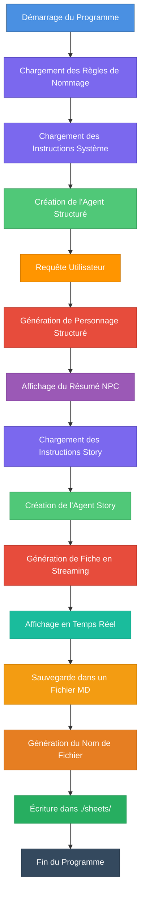

# Générateur de Personnages NPC avec Fiche de Personnage pour D&D

## Description

Ce programme génère automatiquement des personnages non-joueurs (NPC) pour Donjons & Dragons avec leurs fiches de personnage complètes. Il utilise deux agents IA spécialisés basés sur le framework Nova SDK : un pour générer les données structurées du personnage, et un autre pour créer une fiche de personnage narrative détaillée.

## Fonctionnement

Le programme utilise deux agents IA successifs :

1. **Agent de génération structurée** : Crée les informations de base du personnage (nom, race, classe, genre)
2. **Agent de génération narrative** : Produit une fiche de personnage complète avec backstory, apparence physique, traits de personnalité, etc.

### Architecture



## Composants Principaux

### 1. Structure de Données

```go
type NPCCharacter struct {
    FirstName  string  // Prénom
    FamilyName string  // Nom de famille
    Race       string  // Race (Dwarf/Elf/Human)
    Class      string  // Classe D&D
    Gender     string  // Genre (male/female)
}
```

### 2. Base de Connaissances

- **Règles de nommage** (`dnd.naming.rules.md`) : Conventions de noms par race
- **Instructions système NPC** (`dnd.system.instructions.md`) : Directives pour la génération structurée
- **Instructions système Story** (`dnd.story.system.instructions.md`) : Directives pour la fiche de personnage

### 3. Agents IA

#### Agent NPC (Structuré)
- Type : `structured.NewAgent`
- Utilise le type `NPCCharacter` pour la génération structurée
- Configuration créative (`temperature: 0.7`, `topP: 0.9`, `topK: 40`)
- Génère des sorties au format JSON

#### Agent Story (Chat)
- Type : `chat.NewAgent`
- Génération en streaming pour affichage en temps réel
- Configuration très créative (`temperature: 0.8`, `topP: 0.95`)
- Produit une fiche de personnage narrative complète

### 4. Fonctionnalités

- **Génération structurée** : Données de base du personnage
- **Streaming en temps réel** : Affichage progressif de la fiche
- **Sauvegarde automatique** : Fichiers markdown dans `./sheets/`
- **Nommage intelligent** : Noms de fichiers générés automatiquement
  - Exemple : "Eldorin Shadowleaf" → `character-sheet-eldorin-shadowleaf.md`

## Flux d'Exécution

1. **Initialisation**
   - Lecture des règles de nommage D&D
   - Injection des règles dans les instructions système
   - Configuration de la requête utilisateur

2. **Génération du Personnage de Base**
   - Création de l'agent structuré
   - Génération du personnage (nom, race, classe, genre)
   - Affichage du résumé

3. **Génération de la Fiche de Personnage**
   - Chargement des instructions de storytelling
   - Création de l'agent story
   - Génération en streaming avec affichage progressif

4. **Sauvegarde**
   - Génération du nom de fichier sanitisé
   - Écriture dans le dossier `./sheets/`
   - Confirmation de sauvegarde

## Exemple de Sortie

### Console

```
🎲 Starting D&D NPC Character Generation Tests...
🧠 Using Model: huggingface.co/tensorblock/nvidia_nemotron-mini-4b-instruct-gguf:q4_k_m
━━━━━━━━━━━━━━━━━━━━━━━━━━━━━━━━━━━━━━━━━━━━━━━━━━━━━━━━━━━━━━━━
📝 Request: Generate a female elf sorcerer
🔄 Generating NPC...

🧙 Generated NPC Summary:
━━━━━━━━━━━━━━━━━━━━━━━━━━━━━━━━━━━━━━━━━━━━━━━━━━━━━━━━━━━━━━━━
Name       : Elenwe Moonsong
Race       : Elf
Class      : Sorcerer
Gender     : female
━━━━━━━━━━━━━━━━━━━━━━━━━━━━━━━━━━━━━━━━━━━━━━━━━━━━━━━━━━━━━━━━

📖 Creating character sheet with streaming...
━━━━━━━━━━━━━━━━━━━━━━━━━━━━━━━━━━━━━━━━━━━━━━━━━━━━━━━━━━━━━━━━
🤖 Generating character sheet...

# CHARACTER SHEET

## Name and Title
Elenwe Moonsong, Mistress of Arcane Winds
...
```

### Fichier Sauvegardé

Le programme génère un fichier markdown dans `./sheets/` avec :
- **11 sections complètes** : Nom, Âge, Famille, Histoire, Personnalité, Occupation, Compétences, Apparence, Vêtements, Préférences alimentaires, Citation favorite
- **Format markdown structuré** avec titres et sections
- **Contenu narratif riche** adapté à la race et la classe

## Technologies Utilisées

- **Langage** : Go
- **Framework** : Nova SDK
- **Modèle IA** : Nemotron Mini 4B (quantisé Q4_K_M)
- **Moteur** : Docker Model Runner avec endpoint llama.cpp (`http://localhost:12434/engines/llama.cpp/v1`)
- **Format de sortie** : JSON (structuré) + Markdown (narrative)

## Personnalisation

Pour générer un personnage différent, modifiez la variable `query` dans `main.go` :

```go
// NOTE: You can change the query to generate different NPCs
query := "Generate a female elf sorcerer"
```

Exemples de requêtes :
- `"Generate a dwarf warrior"`
- `"Generate a male human paladin"`
- `"Generate a female elf ranger"`

## Exécution

```bash
# Assurez-vous que le dossier ./sheets/ existe
mkdir -p sheets

# Lancez le programme
go run main.go
```

Le programme :
1. Génère un personnage selon la requête
2. Affiche les informations en temps réel
3. Sauvegarde la fiche dans `./sheets/character-sheet-[nom].md`

## Points Clés

- **Double génération** : Structurée + Narrative
- **Streaming temps réel** : Voir la fiche se construire
- **Sauvegarde automatique** : Fichiers markdown réutilisables
- **Nommage intelligent** : Fichiers nommés d'après le personnage
- **Créativité contrôlée** : Paramètres ajustés pour chaque agent
