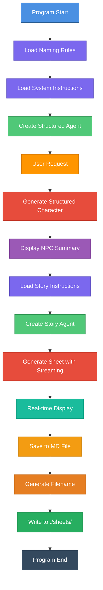

# D&D NPC Character Generator with Character Sheet

## Description

This program automatically generates non-player characters (NPCs) for Dungeons & Dragons with complete character sheets. It uses two specialized AI agents based on the Nova SDK framework: one to generate structured character data, and another to create a detailed narrative character sheet.

## How It Works

The program uses two successive AI agents:

1. **Structured Generation Agent**: Creates basic character information (name, race, class, gender)
2. **Narrative Generation Agent**: Produces a complete character sheet with backstory, physical appearance, personality traits, etc.

### Architecture



## Main Components

### 1. Data Structure

```go
type NPCCharacter struct {
    FirstName  string  // First name
    FamilyName string  // Family name
    Race       string  // Race (Dwarf/Elf/Human)
    Class      string  // D&D class
    Gender     string  // Gender (male/female)
}
```

### 2. Knowledge Base

- **Naming rules** (`dnd.naming.rules.md`): Name conventions by race
- **NPC system instructions** (`dnd.system.instructions.md`): Directives for structured generation
- **Story system instructions** (`dnd.story.system.instructions.md`): Directives for character sheet

### 3. AI Agents

#### NPC Agent (Structured)
- Type: `structured.NewAgent`
- Uses `NPCCharacter` type for structured generation
- Creative configuration (`temperature: 0.7`, `topP: 0.9`, `topK: 40`)
- Generates JSON format output

#### Story Agent (Chat)
- Type: `chat.NewAgent`
- Streaming generation for real-time display
- Highly creative configuration (`temperature: 0.8`, `topP: 0.95`)
- Produces complete narrative character sheet

### 4. Features

- **Structured generation**: Basic character data
- **Real-time streaming**: Progressive display of the sheet
- **Automatic saving**: Markdown files in `./sheets/`
- **Smart naming**: Automatically generated filenames
  - Example: "Eldorin Shadowleaf" → `character-sheet-eldorin-shadowleaf.md`

## Execution Flow

1. **Initialization**
   - Read D&D naming rules
   - Inject rules into system instructions
   - Configure user request

2. **Base Character Generation**
   - Create structured agent
   - Generate character (name, race, class, gender)
   - Display summary

3. **Character Sheet Generation**
   - Load storytelling instructions
   - Create story agent
   - Generate with streaming and progressive display

4. **Saving**
   - Generate sanitized filename
   - Write to `./sheets/` folder
   - Save confirmation

## Sample Output

### Console

```
🎲 Starting D&D NPC Character Generation Tests...
🧠 Using Model: huggingface.co/tensorblock/nvidia_nemotron-mini-4b-instruct-gguf:q4_k_m
━━━━━━━━━━━━━━━━━━━━━━━━━━━━━━━━━━━━━━━━━━━━━━━━━━━━━━━━━━━━━━━━
📝 Request: Generate a female elf sorcerer
🔄 Generating NPC...

🧙 Generated NPC Summary:
━━━━━━━━━━━━━━━━━━━━━━━━━━━━━━━━━━━━━━━━━━━━━━━━━━━━━━━━━━━━━━━━
Name       : Elenwe Moonsong
Race       : Elf
Class      : Sorcerer
Gender     : female
━━━━━━━━━━━━━━━━━━━━━━━━━━━━━━━━━━━━━━━━━━━━━━━━━━━━━━━━━━━━━━━━

📖 Creating character sheet with streaming...
━━━━━━━━━━━━━━━━━━━━━━━━━━━━━━━━━━━━━━━━━━━━━━━━━━━━━━━━━━━━━━━━
🤖 Generating character sheet...

# CHARACTER SHEET

## Name and Title
Elenwe Moonsong, Mistress of Arcane Winds
...
```

### Saved File

The program generates a markdown file in `./sheets/` with:
- **11 complete sections**: Name, Age, Family, Background Story, Personality, Occupation, Abilities, Appearance, Clothing, Food Preferences, Favorite Quote
- **Structured markdown format** with headings and sections
- **Rich narrative content** adapted to race and class

## Technologies Used

- **Language**: Go
- **Framework**: Nova SDK
- **AI Model**: Nemotron Mini 4B (quantized Q4_K_M)
- **Engine**: Docker Model Runner with llama.cpp endpoint (`http://localhost:12434/engines/llama.cpp/v1`)
- **Output format**: JSON (structured) + Markdown (narrative)

## Customization

To generate a different character, modify the `query` variable in `main.go`:

```go
// NOTE: You can change the query to generate different NPCs
query := "Generate a female elf sorcerer"
```

Query examples:
- `"Generate a dwarf warrior"`
- `"Generate a male human paladin"`
- `"Generate a female elf ranger"`

## Execution

```bash
# Make sure the ./sheets/ folder exists
mkdir -p sheets

# Run the program
go run main.go
```

The program:
1. Generates a character according to the request
2. Displays information in real-time
3. Saves the sheet to `./sheets/character-sheet-[name].md`

## Key Points

- **Dual generation**: Structured + Narrative
- **Real-time streaming**: Watch the sheet being built
- **Automatic saving**: Reusable markdown files
- **Smart naming**: Files named after the character
- **Controlled creativity**: Adjusted parameters for each agent
