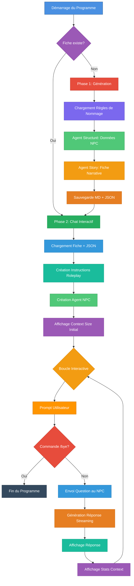

# Chat Interactif avec NPC D&D

## Description

Ce programme génère automatiquement un personnage non-joueur (NPC) pour Donjons & Dragons avec sa fiche complète, puis permet d'**interagir en temps réel** avec ce personnage via un chat interactif en mode roleplay. Le NPC répond en incarnant pleinement son personnage selon sa fiche de personnage.

## Fonctionnement

Le programme fonctionne en deux phases principales :

### Phase 1 : Génération du Personnage (si nécessaire)
1. **Vérification** : Teste si une fiche de personnage existe déjà
2. **Génération structurée** : Crée les données de base (nom, race, classe, genre, mot secret)
3. **Génération narrative** : Produit une fiche complète avec backstory, apparence, personnalité
4. **Sauvegarde** : Stocke la fiche (`.md`) et les données JSON (`.json`)

### Phase 2 : Chat Interactif Roleplay
1. **Chargement** : Lit la fiche de personnage et les données JSON
2. **Configuration** : Crée un agent de roleplay avec les instructions système personnalisées
3. **Conversation** : Boucle interactive où le NPC répond en incarnant son personnage
4. **Streaming** : Affichage en temps réel des réponses du NPC

## Architecture



## Composants Principaux

### 1. Structure de Données (`main.go`)

```go
type NPCCharacter struct {
    FirstName  string  // Prénom
    FamilyName string  // Nom de famille
    Race       string  // Race (Dwarf/Elf/Human)
    Class      string  // Classe D&D
    Gender     string  // Genre (male/female)
    SecretWord string  // Mot secret du personnage
}
```

### 2. Fichiers du Package

#### `main.go` - Point d'entrée
- Vérifie l'existence de la fiche de personnage
- Lance la génération si nécessaire
- Démarre le chat interactif

#### `generate.character.go` - Génération du personnage
- **`generateNewCharacter()`** : Orchestre toute la génération
  - Charge les règles de nommage D&D
  - Crée l'agent structuré pour générer les données de base
  - Crée l'agent story pour générer la fiche narrative
  - Sauvegarde les fichiers `.md` et `.json`

#### `interactive.chat.go` - Chat roleplay
- **`startInteractiveChat()`** : Gère la conversation interactive
  - Charge la fiche de personnage et les données JSON
  - Crée un agent de roleplay configuré avec le personnage
  - Boucle de conversation avec streaming des réponses
  - Affichage de statistiques (finish reason, context size)

#### `helpers.go` - Utilitaires
- **`loadNPCSheetFromFile()`** : Charge la fiche `.md` et les données `.json`
- **`saveNPCSheetToFile()`** : Sauvegarde la fiche `.md` et les données `.json`

### 3. Base de Connaissances

- **`dnd.naming.rules.md`** : Règles de nommage par race
- **`dnd.system.instructions.md`** : Instructions pour la génération structurée
- **`dnd.story.system.instructions.md`** : Instructions pour la fiche narrative
- **`dnd.chat.system.instructions.md`** : Instructions pour le roleplay interactif

### 4. Agents IA Utilisés

#### Agent NPC Generator (Structuré)
- Type : `structured.NewAgent[NPCCharacter]`
- Sortie : Données structurées JSON
- Configuration : `temperature: 0.7`, `topP: 0.9`, `topK: 40`

#### Agent Story Generator (Chat)
- Type : `chat.NewAgent`
- Sortie : Fiche de personnage narrative (streaming)
- Configuration : `temperature: 0.8`, `maxTokens: 4096`, `topP: 0.95`

#### Agent Roleplay (Chat)
- Type : `chat.NewAgent`
- Sortie : Réponses du NPC en roleplay (streaming)
- Configuration : `temperature: 0.9`, `topP: 0.95` (créativité élevée)
- **Personnalisé** : Instructions système incluent toute la fiche du personnage

## Flux d'Exécution

### 1. Démarrage
```go
sheetFilePath := "./sheets/female-elf-sorcerer.md"
```

### 2. Vérification de l'Existence
- Si la fiche existe → Phase 2 (Chat)
- Si absente → Phase 1 (Génération) puis Phase 2

### 3. Phase 1 : Génération (optionnelle)
1. Chargement des règles de nommage
2. Création de l'agent structuré
3. Génération du personnage de base
4. Affichage du résumé NPC
5. Création de l'agent story
6. Génération de la fiche complète (streaming)
7. Sauvegarde `.md` + `.json`

### 4. Phase 2 : Chat Interactif
1. Chargement de la fiche `.md` et des données `.json`
2. Préparation des instructions système personnalisées :
   - Nom, race, classe, genre du NPC
   - Mot secret (pour tester la mémoire)
   - Fiche de personnage complète en contexte
3. Création de l'agent roleplay
4. Affichage du context size initial
5. **Boucle interactive** :
   - Prompt utilisateur avec le nom du NPC
   - Commande `/bye` pour quitter
   - Envoi de la question au NPC
   - Réponse en streaming (affichage en temps réel)
   - Affichage des statistiques (finish reason, context size)

## Exemple de Sortie

### Console - Phase 1 (Génération)

```
🔎 No existing character sheet found at: ./sheets/female-elf-sorcerer.md
🎲 Generating new character...

🎲 D&D NPC Character Generator
━━━━━━━━━━━━━━━━━━━━━━━━━━━━━━━━━━━━━━━━━━━━━━━━━━━━━━━━━━━━━━━━
📝 Request: Generate a female elf sorcerer
🔄 Generating NPC...

🧙 Generated NPC Summary:
Name        : Elenwe Moonsong
Race        : Elf
Class       : Sorcerer
Gender      : female
SecretWord  : Moonwhisper
━━━━━━━━━━━━━━━━━━━━━━━━━━━━━━━━━━━━━━━━━━━━━━━━━━━━━━━━━━━━━━━━

📖 Creating character sheet for Elenwe Moonsong...
━━━━━━━━━━━━━━━━━━━━━━━━━━━━━━━━━━━━━━━━━━━━━━━━━━━━━━━━━━━━━━━━
🤖 Generating character sheet...

# CHARACTER SHEET

## Name and Title
Elenwe Moonsong, Mistress of Arcane Winds
...

✅ Character sheet and NPC data saved successfully.
Character Sheet Path : ./sheets/female-elf-sorcerer.md
NPC JSON Path        : ./sheets/female-elf-sorcerer.json
```

### Console - Phase 2 (Chat Interactif)

```
💬 Starting interactive chat with NPC...
━━━━━━━━━━━━━━━━━━━━━━━━━━━━━━━━━━━━━━━━━━━━━━━━━━━━━━━━━━━━━━━━
Initial Context Size: 2847 characters
━━━━━━━━━━━━━━━━━━━━━━━━━━━━━━━━━━━━━━━━━━━━━━━━━━━━━━━━━━━━━━━━

🤖 Ask me something? [Elenwe Moonsong] ▋ Hello! What is your name?

Greetings, traveler. I am Elenwe Moonsong, Mistress of Arcane Winds.
My magic flows from the moon itself, and I walk the paths between worlds.
What brings you to my presence?

━━━━━━━━━━━━━━━━━━━━━━━━━━━━━━━━━━━━━━━━━━━━━━━━━━━━━━━━━━━━━━━━
Finish reason : stop
Context size  : 3124 characters
━━━━━━━━━━━━━━━━━━━━━━━━━━━━━━━━━━━━━━━━━━━━━━━━━━━━━━━━━━━━━━━━

🤖 Ask me something? [Elenwe Moonsong] ▋ What is your secret word?

*smiles mysteriously* Ah, you seek to test my memory? Very well.
My secret word is "Moonwhisper" - known only to those I trust.
Why do you ask, stranger?

━━━━━━━━━━━━━━━━━━━━━━━━━━━━━━━━━━━━━━━━━━━━━━━━━━━━━━━━━━━━━━━━
Finish reason : stop
Context size  : 3456 characters
━━━━━━━━━━━━━━━━━━━━━━━━━━━━━━━━━━━━━━━━━━━━━━━━━━━━━━━━━━━━━━━━

🤖 Ask me something? [Elenwe Moonsong] ▋ /bye

👋 Goodbye!
👋 Conversation ended.
```

## Caractéristiques Principales

### 1. Réutilisation des Fiches
- Vérification automatique de l'existence
- Pas de regénération si le personnage existe déjà
- Séparation des données (`.json`) et du narratif (`.md`)

### 2. Roleplay Immersif
- Le NPC répond en incarnant son personnage
- Fiche complète chargée en contexte
- Mot secret pour tester la cohérence
- Haute créativité (`temperature: 0.9`)

### 3. Interface Utilisateur
- **Prompt personnalisé** : Affiche le nom du NPC
- **Curseur clignotant** : Style block blink
- **Streaming** : Réponses affichées en temps réel
- **Statistiques** : Context size et finish reason après chaque réponse
- **Commande de sortie** : `/bye` pour terminer proprement

### 4. Persistance Double
- **`.md`** : Fiche de personnage lisible (11 sections)
- **`.json`** : Données structurées pour le chat
  ```json
  {
    "firstName": "Elenwe",
    "familyName": "Moonsong",
    "race": "Elf",
    "class": "Sorcerer",
    "gender": "female",
    "secretWord": "Moonwhisper"
  }
  ```

## Technologies Utilisées

- **Langage** : Go
- **Framework** : Nova SDK
- **Modèles IA** :
  - Generator : `nvidia_nemotron-mini-4b-instruct-gguf:q4_k_m`
  - NPC Roleplay : `qwen2.5:0.5B-F16`
- **Moteur** : Docker Model Runner (llama.cpp)
- **UI** : Nova SDK Display & Prompt

## Personnalisation

Pour générer un personnage différent, modifiez dans `main.go` :

```go
query := "Generate a female elf sorcerer"
sheetFilePath := "./sheets/female-elf-sorcerer.md"
```

Exemples :
- `"Generate a dwarf warrior"` → `"./sheets/dwarf-warrior.md"`
- `"Generate a male human paladin"` → `"./sheets/human-paladin.md"`
- `"Generate a halfling rogue"` → `"./sheets/halfling-rogue.md"`

## Exécution

```bash
# Créer le dossier de sauvegarde
mkdir -p sheets

# Lancer le programme
go run .

# OU avec un fichier spécifique
go run main.go generate.character.go interactive.chat.go helpers.go
```

## Points Clés

- **Génération conditionnelle** : Ne régénère pas si la fiche existe
- **Double persistance** : Markdown (narratif) + JSON (données)
- **Chat contextualisé** : Fiche complète injectée dans les instructions système
- **Roleplay immersif** : NPC répond en incarnant pleinement son personnage
- **Streaming temps réel** : Voir le NPC "penser" et répondre
- **Statistiques en direct** : Context size pour surveiller la mémoire
- **Interface intuitive** : Prompt avec nom du NPC, commande `/bye`
