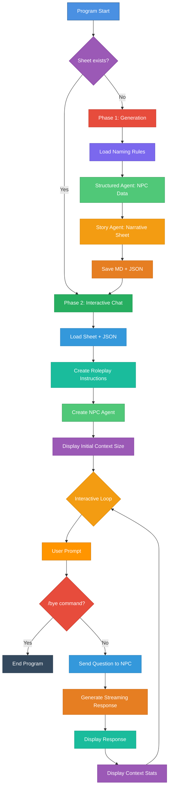

# Interactive Chat with D&D NPC

## Description

This program automatically generates a non-player character (NPC) for Dungeons & Dragons with their complete character sheet, then allows **real-time interaction** with this character via an interactive chat in roleplay mode. The NPC responds by fully embodying their character according to their character sheet.

## How It Works

The program operates in two main phases:

### Phase 1: Character Generation (if needed)
1. **Verification**: Tests if a character sheet already exists
2. **Structured generation**: Creates basic data (name, race, class, gender, secret word)
3. **Narrative generation**: Produces a complete sheet with backstory, appearance, personality
4. **Save**: Stores the sheet (`.md`) and JSON data (`.json`)

### Phase 2: Interactive Roleplay Chat
1. **Loading**: Reads the character sheet and JSON data
2. **Configuration**: Creates a roleplay agent with personalized system instructions
3. **Conversation**: Interactive loop where the NPC responds by embodying their character
4. **Streaming**: Real-time display of NPC responses

## Architecture



## Main Components

### 1. Data Structure (`main.go`)

```go
type NPCCharacter struct {
    FirstName  string  // First name
    FamilyName string  // Family/clan/house name
    Race       string  // Race (Dwarf/Elf/Human)
    Class      string  // D&D character class
    Gender     string  // Gender (male/female)
    SecretWord string  // Character's secret word
}
```

### 2. Package Files

#### `main.go` - Entry point
- Checks for character sheet existence
- Launches generation if needed
- Starts interactive chat

#### `generate.character.go` - Character generation
- **`generateNewCharacter()`**: Orchestrates entire generation
  - Loads D&D naming rules
  - Creates structured agent to generate basic data
  - Creates story agent to generate narrative sheet
  - Saves `.md` and `.json` files

#### `interactive.chat.go` - Roleplay chat
- **`startInteractiveChat()`**: Manages interactive conversation
  - Loads character sheet and JSON data
  - Creates roleplay agent configured with character
  - Conversation loop with streaming responses
  - Displays statistics (finish reason, context size)

#### `helpers.go` - Utilities
- **`loadNPCSheetFromFile()`**: Loads `.md` sheet and `.json` data
- **`saveNPCSheetToFile()`**: Saves `.md` sheet and `.json` data

### 3. Knowledge Base

- **`dnd.naming.rules.md`**: Naming rules by race
- **`dnd.system.instructions.md`**: Instructions for structured generation
- **`dnd.story.system.instructions.md`**: Instructions for narrative sheet
- **`dnd.chat.system.instructions.md`**: Instructions for interactive roleplay

### 4. AI Agents Used

#### NPC Generator Agent (Structured)
- Type: `structured.NewAgent[NPCCharacter]`
- Output: Structured JSON data
- Configuration: `temperature: 0.7`, `topP: 0.9`, `topK: 40`

#### Story Generator Agent (Chat)
- Type: `chat.NewAgent`
- Output: Narrative character sheet (streaming)
- Configuration: `temperature: 0.8`, `maxTokens: 4096`, `topP: 0.95`

#### Roleplay Agent (Chat)
- Type: `chat.NewAgent`
- Output: NPC responses in roleplay (streaming)
- Configuration: `temperature: 0.9`, `topP: 0.95` (high creativity)
- **Personalized**: System instructions include full character sheet

## Execution Flow

### 1. Startup
```go
sheetFilePath := "./sheets/female-elf-sorcerer.md"
```

### 2. Existence Check
- If sheet exists → Phase 2 (Chat)
- If missing → Phase 1 (Generation) then Phase 2

### 3. Phase 1: Generation (optional)
1. Load naming rules
2. Create structured agent
3. Generate base character
4. Display NPC summary
5. Create story agent
6. Generate complete sheet (streaming)
7. Save `.md` + `.json`

### 4. Phase 2: Interactive Chat
1. Load `.md` sheet and `.json` data
2. Prepare personalized system instructions:
   - NPC name, race, class, gender
   - Secret word (to test memory)
   - Complete character sheet in context
3. Create roleplay agent
4. Display initial context size
5. **Interactive loop**:
   - User prompt with NPC name
   - `/bye` command to quit
   - Send question to NPC
   - Streaming response (real-time display)
   - Display statistics (finish reason, context size)

## Example Output

### Console - Phase 1 (Generation)

```
🔎 No existing character sheet found at: ./sheets/female-elf-sorcerer.md
🎲 Generating new character...

🎲 D&D NPC Character Generator
━━━━━━━━━━━━━━━━━━━━━━━━━━━━━━━━━━━━━━━━━━━━━━━━━━━━━━━━━━━━━━━━
📝 Request: Generate a female elf sorcerer
🔄 Generating NPC...

🧙 Generated NPC Summary:
Name        : Elenwe Moonsong
Race        : Elf
Class       : Sorcerer
Gender      : female
SecretWord  : Moonwhisper
━━━━━━━━━━━━━━━━━━━━━━━━━━━━━━━━━━━━━━━━━━━━━━━━━━━━━━━━━━━━━━━━

📖 Creating character sheet for Elenwe Moonsong...
━━━━━━━━━━━━━━━━━━━━━━━━━━━━━━━━━━━━━━━━━━━━━━━━━━━━━━━━━━━━━━━━
🤖 Generating character sheet...

# CHARACTER SHEET

## Name and Title
Elenwe Moonsong, Mistress of Arcane Winds
...

✅ Character sheet and NPC data saved successfully.
Character Sheet Path : ./sheets/female-elf-sorcerer.md
NPC JSON Path        : ./sheets/female-elf-sorcerer.json
```

### Console - Phase 2 (Interactive Chat)

```
💬 Starting interactive chat with NPC...
━━━━━━━━━━━━━━━━━━━━━━━━━━━━━━━━━━━━━━━━━━━━━━━━━━━━━━━━━━━━━━━━
Initial Context Size: 2847 characters
━━━━━━━━━━━━━━━━━━━━━━━━━━━━━━━━━━━━━━━━━━━━━━━━━━━━━━━━━━━━━━━━

🤖 Ask me something? [Elenwe Moonsong] ▋ Hello! What is your name?

Greetings, traveler. I am Elenwe Moonsong, Mistress of Arcane Winds.
My magic flows from the moon itself, and I walk the paths between worlds.
What brings you to my presence?

━━━━━━━━━━━━━━━━━━━━━━━━━━━━━━━━━━━━━━━━━━━━━━━━━━━━━━━━━━━━━━━━
Finish reason : stop
Context size  : 3124 characters
━━━━━━━━━━━━━━━━━━━━━━━━━━━━━━━━━━━━━━━━━━━━━━━━━━━━━━━━━━━━━━━━

🤖 Ask me something? [Elenwe Moonsong] ▋ What is your secret word?

*smiles mysteriously* Ah, you seek to test my memory? Very well.
My secret word is "Moonwhisper" - known only to those I trust.
Why do you ask, stranger?

━━━━━━━━━━━━━━━━━━━━━━━━━━━━━━━━━━━━━━━━━━━━━━━━━━━━━━━━━━━━━━━━
Finish reason : stop
Context size  : 3456 characters
━━━━━━━━━━━━━━━━━━━━━━━━━━━━━━━━━━━━━━━━━━━━━━━━━━━━━━━━━━━━━━━━

🤖 Ask me something? [Elenwe Moonsong] ▋ /bye

👋 Goodbye!
👋 Conversation ended.
```

## Key Features

### 1. Sheet Reusability
- Automatic existence check
- No regeneration if character already exists
- Separation of data (`.json`) and narrative (`.md`)

### 2. Immersive Roleplay
- NPC responds by embodying their character
- Complete sheet loaded in context
- Secret word to test coherence
- High creativity (`temperature: 0.9`)

### 3. User Interface
- **Personalized prompt**: Displays NPC name
- **Blinking cursor**: Block blink style
- **Streaming**: Responses displayed in real-time
- **Statistics**: Context size and finish reason after each response
- **Exit command**: `/bye` to terminate properly

### 4. Dual Persistence
- **`.md`**: Readable character sheet (11 sections)
- **`.json`**: Structured data for chat
  ```json
  {
    "firstName": "Elenwe",
    "familyName": "Moonsong",
    "race": "Elf",
    "class": "Sorcerer",
    "gender": "female",
    "secretWord": "Moonwhisper"
  }
  ```

## Technologies Used

- **Language**: Go
- **Framework**: Nova SDK
- **AI Models**:
  - Generator: `nvidia_nemotron-mini-4b-instruct-gguf:q4_k_m`
  - NPC Roleplay: `qwen2.5:0.5B-F16`
- **Engine**: Docker Model Runner (llama.cpp)
- **UI**: Nova SDK Display & Prompt

## Customization

To generate a different character, modify in `main.go`:

```go
query := "Generate a female elf sorcerer"
sheetFilePath := "./sheets/female-elf-sorcerer.md"
```

Examples:
- `"Generate a dwarf warrior"` → `"./sheets/dwarf-warrior.md"`
- `"Generate a male human paladin"` → `"./sheets/human-paladin.md"`
- `"Generate a halfling rogue"` → `"./sheets/halfling-rogue.md"`

## Running the Program

```bash
# Create save folder
mkdir -p sheets

# Run the program
go run .

# OR with specific files
go run main.go generate.character.go interactive.chat.go helpers.go
```

## Key Points

- **Conditional generation**: Does not regenerate if sheet exists
- **Dual persistence**: Markdown (narrative) + JSON (data)
- **Contextualized chat**: Complete sheet injected into system instructions
- **Immersive roleplay**: NPC fully embodies their character
- **Real-time streaming**: Watch the NPC "think" and respond
- **Live statistics**: Context size to monitor memory
- **Intuitive interface**: Prompt with NPC name, `/bye` command
