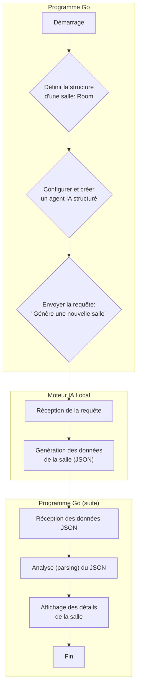

# 01 - Room Generation

Ce programme Go sert à générer une pièce (une "salle") pour un jeu d'aventure textuel, un peu comme un "donjon".

## Fonctionnement

1.  Il définit la structure d'une `Room` (salle) qui doit contenir : un nom, une description, une description courte et une liste d'objets.
2.  Il se connecte à un moteur d'Intelligence Artificielle qui doit tourner en local (par exemple avec [Jan](https://jan.ai/)) à l'adresse `http://localhost:12434`.
3.  Il donne des instructions précises à cet agent IA pour qu'il agisse comme un "maître du donjon".
4.  Il lui demande de générer une nouvelle salle en respectant la structure définie (nom, description, objets, etc.).
5.  Une fois que l'IA a renvoyé les informations de la salle au format JSON, le programme les lit.
6.  Enfin, il affiche les détails de la salle nouvellement créée dans le terminal.

En bref, ce programme utilise une IA locale pour créer de manière procédurale des salles de donjon uniques et intéressantes.

<details>
<summary>Diagramme de fonctionnement</summary>


</details>

## Comment l'utiliser

1.  Assurez-vous d'avoir un serveur OpenAI compatible tournant à l'adresse `http://localhost:12434`. Vous pouvez utiliser [Jan](https://jan.ai/), [LM Studio](https://lmstudio.ai/), ou [Ollama](https://ollama.com/) par exemple.
2.  Exécutez le programme :
    ```bash
    go run main.go
    ```
