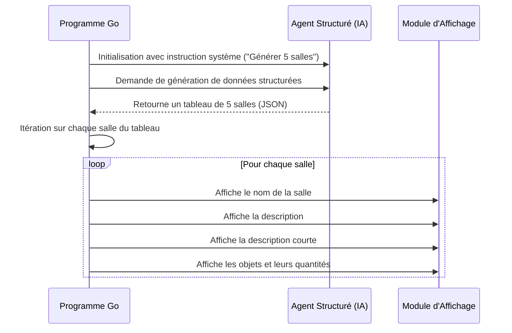

# 02-rooms-generation

Ce programme Go utilise un modèle de langage (via un agent structuré) pour générer cinq salles de donjon distinctes pour un jeu d'aventure textuel. Chaque salle est créée avec un nom, une description détaillée, une description courte et une liste d'objets (trésors, potions, armes) avec leurs quantités respectives.

Le programme envoie une instruction système à un agent IA, lui demandant de créer 5 salles uniques. L'agent renvoie les données structurées sous forme de JSON, qui sont ensuite désérialisées en un tableau de structures `Room` en Go. Finalement, le programme parcourt ce tableau et affiche les détails de chaque salle de manière formatée dans la console.

## Diagramme de Séquence

Le diagramme ci-dessous illustre le flux d'exécution du programme.

## Comparaison avec `01-room-generation`

La principale différence entre ce projet et `01-room-generation` réside dans le **nombre de salles générées** en un seul appel :

-   **`01-room-generation`**: Conçu pour générer **une seule** salle de donjon. Le type de données attendu de l'agent est `Room`.
-   **`02-rooms-generation`**: Conçu pour générer **plusieurs** salles (cinq dans ce cas) en une seule fois. Le type de données attendu de l'agent est un tableau de salles (`[]Room`).

Cette évolution démontre la capacité de l'agent structuré à générer des listes d'objets complexes, et pas seulement des objets uniques, en adaptant simplement le type de données Go attendu et la consigne (prompt) fournie.
