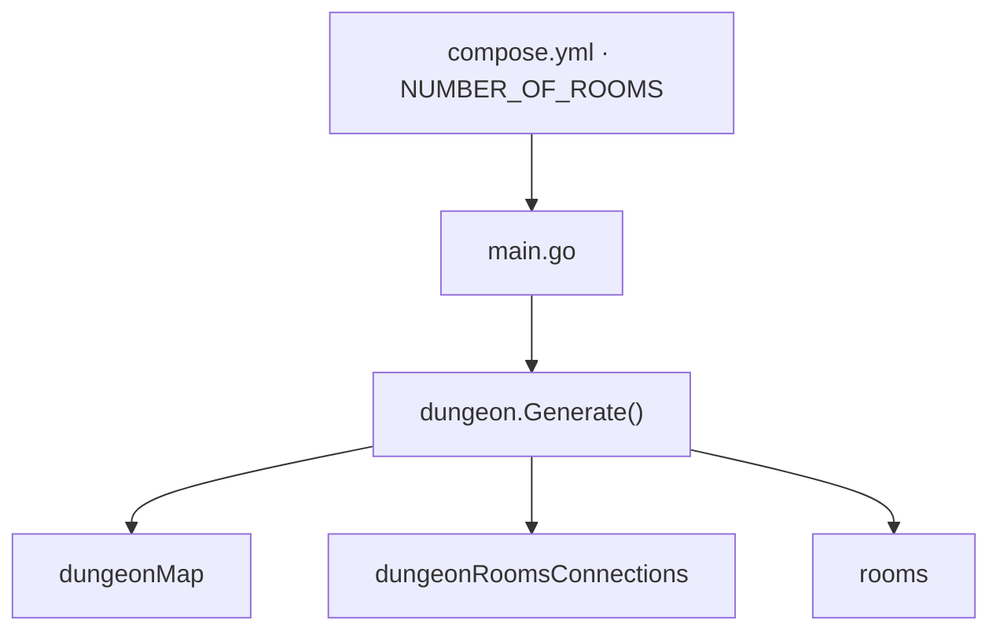

<style>
.dodgerblue {
  color: dodgerblue;
}
.indianred {
  color: indianred;
}
.seagreen {
  color: seagreen;
}
.small-diagram {
  transform: scale(0.70);
  transform-origin: top left;
}

section {
  padding-top: 5px;
  padding-bottom: 5px;
}
</style>
# 🏰 Dungeon Generation | **Step 1: Procedural Generation**

Uses the local <span class="indianred">**`dungeon`**</span> library to build the dungeon structure.
The number of rooms is set via the <span class="dodgerblue">**`NUMBER_OF_ROOMS`**</span> environment variable in `compose.yml`.

```golang
dng := dungeon.NewDungeon()
dng.Generate(nbDungeonRooms)
```

```golang
dungeonMap := dng.GetBWDetailedGridCompact()
dungeonRoomsConnections := dng.GetDungeonDescriptionText()
rooms := dng.GetRooms()
```

> Produces a grid of **empty connected rooms** — no names, no items, no monsters yet.


