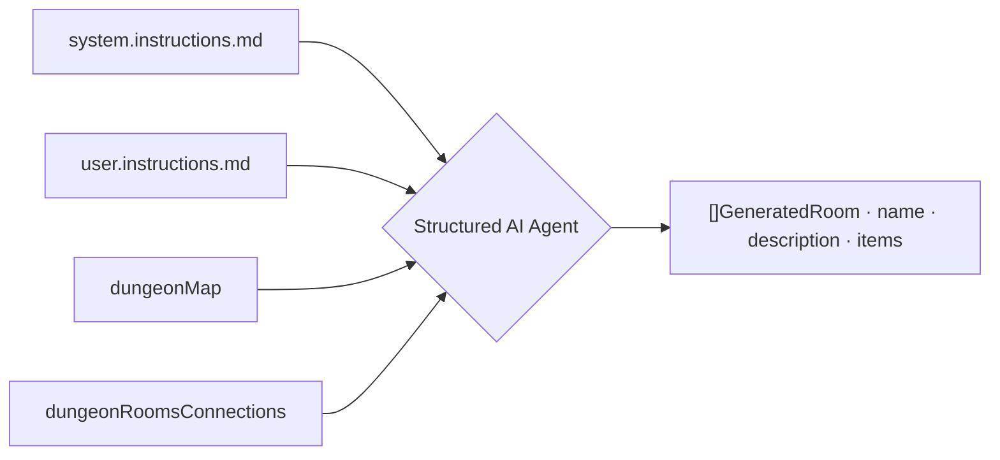

<style>
.dodgerblue {
  color: dodgerblue;
}
.indianred {
  color: indianred;
}
.seagreen {
  color: seagreen;
}
.small-diagram {
  transform: scale(0.70);
  transform-origin: top left;
}

section {
  padding-top: 5px;
  padding-bottom: 5px;
}
</style>
# 🏰 Dungeon Generation | **Step 2: AI Content Generation**

```golang
type GeneratedRoom struct {
    Name        string `json:"name"`
    Description string `json:"description"`
    Items       []Item `json:"items"`
}
```

```golang
dungeonGeneratorAgent, err := structured.NewAgent[[]GeneratedRoom](...)

dungeonGeneratorAgent.AddMessage(roles.System, `DUNGEON MAP:\n`+dungeonMap+`\n`)
dungeonGeneratorAgent.AddMessage(roles.System, `DUNGEON ROOMS CONNECTIONS:\n`+dungeonRoomsConnections+`\n`)
```

```golang
generatedRooms, finishReason, err := dungeonGeneratorAgent.GenerateStructuredData(...)
```

> Instructions are injected via <span class="indianred">**`system.instructions.md`**</span> and <span class="dodgerblue">**`user.instructions.md`**</span>


