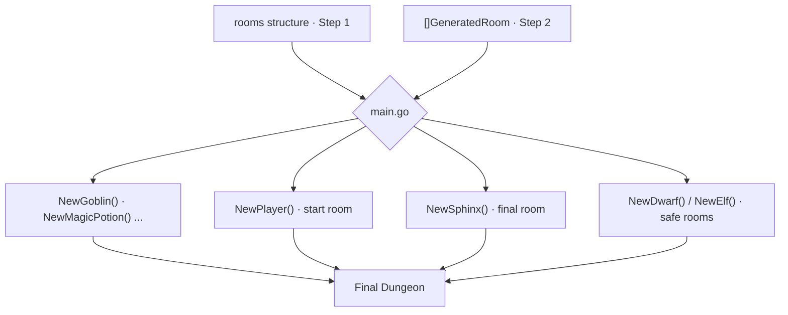

<style>
.dodgerblue {
  color: dodgerblue;
}
.indianred {
  color: indianred;
}
.seagreen {
  color: seagreen;
}
.small-diagram {
  transform: scale(0.70);
  transform-origin: top left;
}

section {
  padding-top: 5px;
  padding-bottom: 5px;
}
</style>
# 🏰 Dungeon Generation | **Step 3: Assembly & Logic**

Merges the procedural structure with AI content, then instantiates all Go entities.

```golang
// Each item returned by the AI triggers the matching Go constructor
for _, item := range generatedRoom.Items {
    switch item.Kind {
    case "goblin":
        room.AddCharacter(monsters.NewGoblin())
    case "magic_potion":
        room.AddObject(objects.NewMagicPotion())
    }
}
```

```golang
// Entities not generated by AI are added explicitly
dungeon.Rooms[0].AddCharacter(player.NewPlayer())   // start room
dungeon.Rooms[last].AddCharacter(boss.NewSphinx())  // final room
// NPCs (Dwarf, Elf) are placed in monster-free rooms
```

> Every entity carries <span class="indianred">**stats**</span> (HP, strength) and an <span class="dodgerblue">**ASCII-art**</span> pattern (`ObjectPatterns`).


