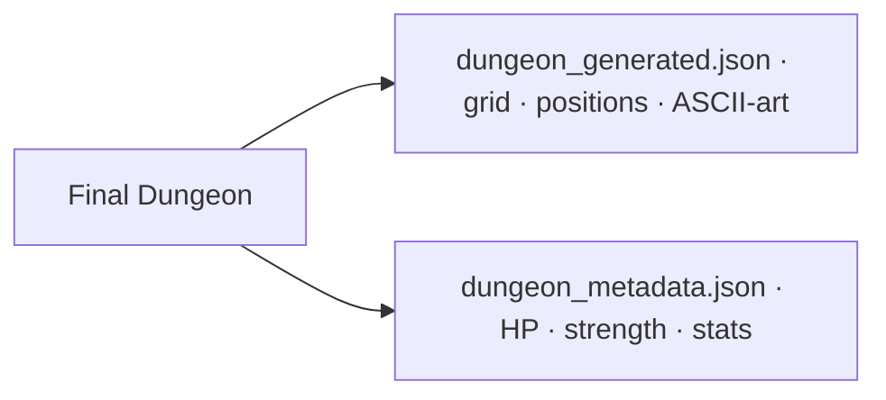

# 🏰 Dungeon Generation | **Step 4: Serialization**

The assembled dungeon is saved into **two separate JSON files**.

```mermaid
graph LR
    A["Final Dungeon"] --> B["dungeon_generated.json · grid · positions · ASCII-art"]
    A --> C["dungeon_metadata.json · HP · strength · stats"]
```