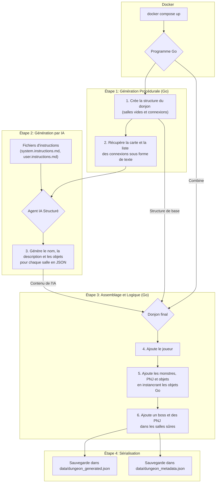

# 03-dungeon-generation

Ce projet est une étape majeure dans la création du jeu. Il orchestre la génération d'un donjon complet en combinant la génération procédurale pour la structure, l'intelligence artificielle pour le contenu créatif, et une logique de jeu pour peupler le monde.

Le processus se déroule en plusieurs phases et produit deux fichiers de sortie principaux : `dungeon_generated.json` (la structure visuelle et la disposition du donjon) et `dungeon_metadata.json` (les statistiques des entités).

## Architecture et Flux de Génération

Le système est orchestré par `docker-compose` qui lance un conteneur pour exécuter le programme Go. Le programme suit un flux précis pour construire le donjon.



### Description des Étapes

1.  **Génération Procédurale**: Le programme `main.go` commence par utiliser la bibliothèque locale `dungeon` pour créer une grille de salles connectées. Le nombre de salles est défini par la variable d'environnement `NUMBER_OF_ROOMS` dans `compose.yml`.

2.  **Génération par IA**:
    *   Le programme lit les instructions système et utilisateur depuis les fichiers `.md` fournis via la configuration Docker.
    *   Il envoie ces instructions, ainsi que la carte du donjon générée à l'étape 1, à un agent IA structuré.
    *   L'agent IA renvoie une liste (`[]GeneratedRoom`) contenant le nom, la description et les objets (`items`) pour chaque salle, en respectant les contraintes du prompt (ex: probabilité de salles vides).

3.  **Assemblage et Logique**:
    *   Le programme itère sur les données de l'IA et peuple les salles de la structure initialement vide.
    *   Pour chaque `item` (ex: `goblin`, `potion`) retourné par l'IA, le programme appelle le constructeur correspondant (`NewGoblin`, `NewMagicPotion`, etc.).
    *   Chaque constructeur (`monsters.goblin.go`, `potion.go`, etc.) instancie une structure Go qui contient non seulement des statistiques (vie, force) mais aussi des `ObjectPatterns`, c'est-à-dire une représentation visuelle en ASCII-art.
    *   Enfin, le programme ajoute des entités non générées par l'IA : le joueur au début, un boss (Sphinx) à la fin, et des PNJ (Nain, Elfe) dans des salles sans monstres pour les rendre "sûres".

4.  **Sérialisation**:
    *   `dungeon_generated.json`: Ce fichier contient l'intégralité du donjon assemblé, y compris la grille, la position des entités et leur représentation visuelle.
    *   `dungeon_metadata.json`: Pour faciliter la gestion de l'état du jeu, les statistiques (vie, force) de chaque entité (joueur, monstres, PNJ) sont extraites et sauvegardées dans ce fichier séparé. Le fichier `metadata.go` gère la structure et la sauvegarde de ces données.

## Rôle des Fichiers de Code

-   **`compose.yml`**: Orchestre le lancement, configure les variables d'environnement (comme `NUMBER_OF_ROOMS`), et injecte les prompts de l'IA dans le conteneur.
-   **`main.go`**: Le chef d'orchestre principal qui exécute les 4 étapes décrites ci-dessus.
-   **`*.go` (hors `main.go`)**: Définissent les modèles de données pour chaque entité du jeu (Joueur, Monstres, PNJ, Objets). Ils sont responsables de la création de ces entités, de leurs statistiques initiales et de leur apparence visuelle.
-   **`metadata.go`**: Définit la structure pour stocker les données de jeu (vie, force) et fournit des fonctions pour sauvegarder et charger ces métadonnées.

## Lancer le générateur de donjon

```bash
docker compose up --build --no-log-prefix 
```
Cela lancera le générateur de donjon qui créera un donjon, l'affichera dans la console, et le sauvegardera dans les fichiers JSON dans le dossier `data/`.