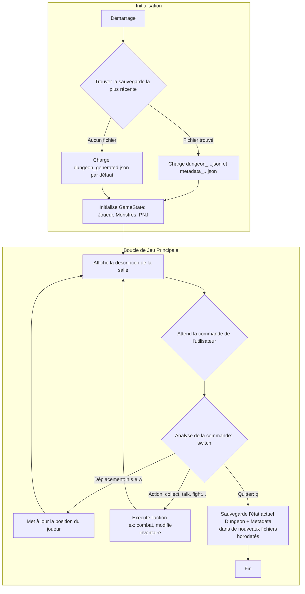

# Dungeon Adventure Game

Un jeu d'aventure interactif en mode texte où vous explorez un donjon, combattez des monstres, résolvez des énigmes et collectez des trésors. Ce projet intègre une boucle de jeu complète avec un système de sauvegarde et de chargement.

## Fonctionnalités Principales

- **Exploration**: Naviguez dans un donjon généré procéduralement avec des descriptions de salles et des connexions variables.
- **Combat au Tour par Tour**: Affrontez des monstres (gobelins, squelettes, vampires) dans un système de combat basé sur des jets de dés.
- **Gestion d'Inventaire**: Collectez de l'or et des potions. Utilisez les potions pour regagner de la santé.
- **Interaction avec les PNJ**: Parlez avec différents personnages non-joueurs (Nains, Elfes) pour obtenir des indices.
- **Énigmes**: Résolvez l'énigme du Sphinx pour débloquer la sortie du donjon.
- **Système de Sauvegarde/Chargement**: Votre progression est automatiquement sauvegardée dans un fichier horodaté lorsque vous quittez le jeu. Au lancement, le jeu charge la sauvegarde la plus récente.

## Lancement du jeu

```bash
# S'assure que les dépendances sont correctes
go mod tidy
# Lance le jeu
go run .
```

## Commandes disponibles

- **Déplacement**
  - `n`, `north` - Se déplacer vers le nord
  - `s`, `south` - Se déplacer vers le sud
  - `e`, `east` - Se déplacer vers l'est
  - `w`, `west` - Se déplacer vers l'ouest (permet de fuir un combat)

- **Actions**
  - `l`, `look` - Observer la salle actuelle
  - `m`, `map` - Afficher la carte complète du donjon
  - `c`, `collect` - Collecter les objets dans la salle
  - `i`, `inventory` - Afficher votre inventaire et vos statistiques
  - `d`, `drink` - Boire une potion pour restaurer sa santé
  - `t`, `talk` - Parler aux PNJ présents dans la salle
  - `f`, `fight` - Engager ou poursuivre le combat avec un monstre

- **Système**
  - `h`, `help` - Afficher l'aide
  - `q`, `quit` - Sauvegarder et quitter le jeu

## Architecture et Boucle de Jeu

Le jeu est construit autour d'une boucle principale qui attend les commandes de l'utilisateur et met à jour l'état du jeu en conséquence. La structure `GameState` centralise toutes les informations : le donjon, le joueur, les monstres, les PNJ et l'état du combat.



## Structure du Projet

```
05-game/
├── main.go              # Point d'entrée, chargement initial et boucle de jeu
├── game.go              # Logique centrale: GameState, gestion des commandes, combat
├── player.go            # Gestion du joueur et de son inventaire
├── metadata.go          # Structures et fonctions pour (dé)sérialiser l'état du jeu
├── gold.coins.go        # Objets: pièces d'or
├── potion.go            # Objets: potions
├── monsters.*.go        # Fichiers de définition pour chaque type de monstre
├── npc.*.go             # Fichiers de définition pour chaque type de PNJ
├── go.mod
└── data/
    ├── dungeon_generated.json  # Données initiales du donjon
    └── dungeon_metadata.json   # Métadonnées initiales
```

## Conception

- **`main.go`**: Orchestre le lancement, le chargement de la sauvegarde la plus récente et héberge la boucle de jeu principale qui interprète les commandes de l'utilisateur.
- **`game.go`**: Agit comme le moteur du jeu. La structure `GameState` centralise toutes les données dynamiques. Ce fichier contient la logique pour l'affichage des salles, le déroulement des combats, la collecte d'objets et les interactions.
- **`player.go`** & **`metadata.go`**: Ces fichiers sont cruciaux pour la persistance des données. `player.go` définit l'inventaire, tandis que `metadata.go` définit les structures de données qui sont sérialisées en JSON pour sauvegarder l'état du joueur (vie, inventaire) et du monde (monstres restants, énigme résolue).
- **Fichiers d'entités (`monsters.*.go`, `npc.*.go`, etc.)**: Définissent les structures de données pour chaque type d'entité, contenant leurs statistiques comme la vie et la force.