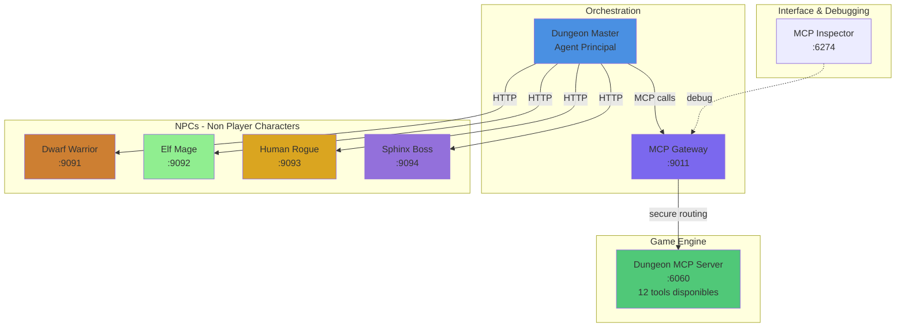
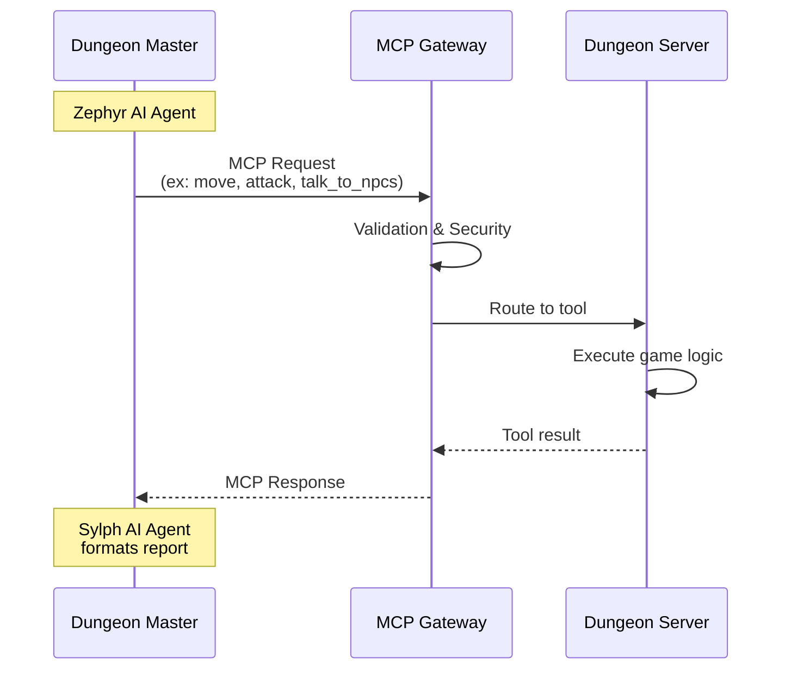
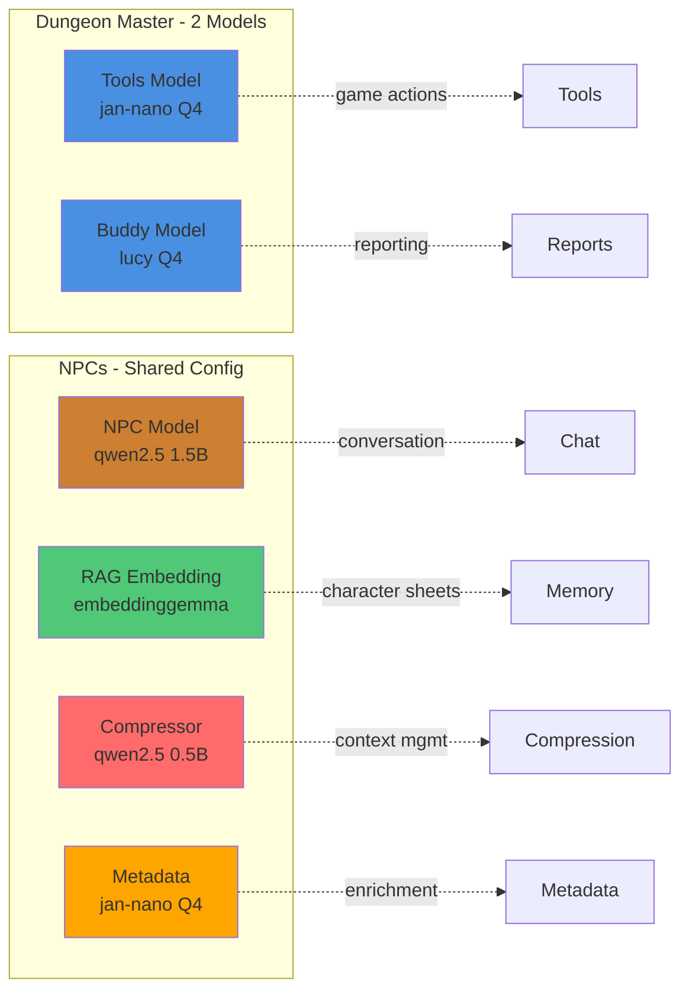
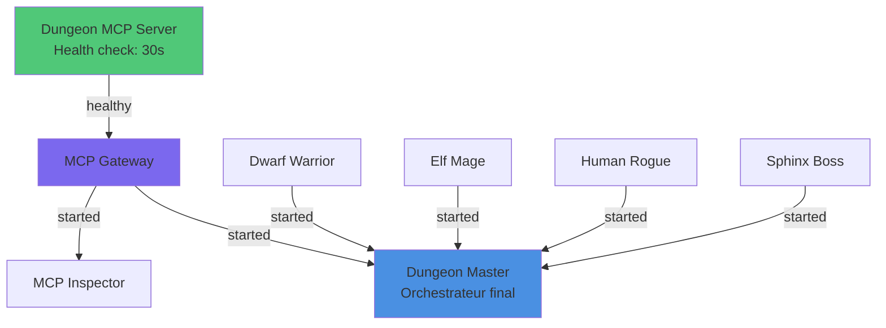
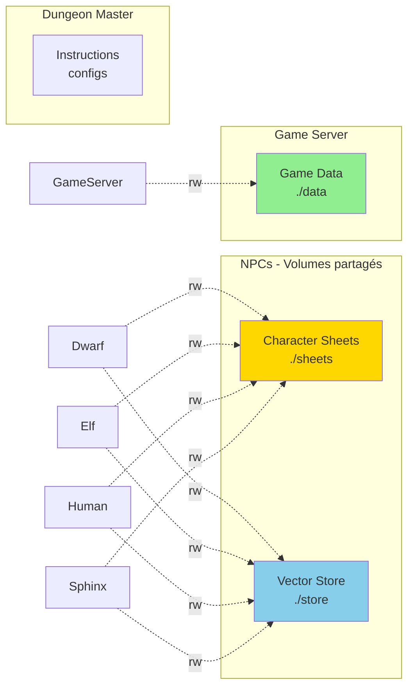

# Architecture - Compose & Dragons

Documentation de l'architecture du système de jeu basé sur Docker Compose, MCP et agents AI.

## Table des matières

- [Vue d'ensemble](#vue-densemble)
- [Architecture générale des services](#1-architecture-générale-des-services)
- [Flux des requêtes MCP](#2-flux-des-requêtes-mcp)
- [Architecture des modèles AI](#3-architecture-des-modèles-ai)
- [Dépendances et démarrage](#4-dépendances-et-démarrage)
- [Configuration des volumes et données](#5-configuration-des-volumes-et-données)
- [Détails des services](#détails-des-services)

## Vue d'ensemble

Ce projet implémente un jeu de type donjon basé sur D&D 5e, orchestré par des agents AI et utilisant le protocole MCP (Model Context Protocol) pour les interactions avec le moteur de jeu.

### Composants principaux

- **Dungeon Master** : Agent AI principal (Zephyr) qui orchestre le jeu
- **MCP Gateway** : Sécurise et route les appels MCP vers les serveurs
- **Dungeon MCP Server** : Moteur de jeu exposant 12 outils via MCP
- **4 NPCs** : Personnages non-joueurs avec leur propre personnalité AI
- **MCP Inspector** : Outil de debugging pour les interactions MCP

---

## 1. Architecture générale des services

Ce diagramme montre l'organisation globale des services et leurs connexions.



### Points clés
- Le **Dungeon Master** communique avec le moteur de jeu via MCP
- Les **NPCs** sont accessibles via HTTP direct pour les conversations
- Le **MCP Inspector** permet de debugger les interactions MCP
- Le **MCP Gateway** centralise et sécurise tous les appels MCP

---

## 2. Flux des requêtes MCP

Ce diagramme illustre comment une requête MCP circule dans le système.



### Outils MCP disponibles

Le Dungeon MCP Server expose 12 outils :
- `get_map` - Carte ASCII du donjon
- `answer_riddle` - Répondre aux énigmes du Sphinx
- `attack` - Attaquer un ennemi (en combat)
- `collect_items` - Ramasser or et potions
- `drink_potion` - Boire une potion (+5 HP)
- `move` - Se déplacer (north/south/east/west)
- `save_game` - Sauvegarder la partie
- `start_combat` - Initier un combat
- `talk_to_npcs` - Parler aux NPCs
- `get_current_room` - Info détaillée de la salle
- `get_game_status` - Statut du jeu
- `get_inventory` - Inventaire du joueur
- `get_help` - Aide contextuelle

---

## 3. Architecture des modèles AI

Le système utilise 6 modèles AI différents pour différentes tâches.



### Configuration des modèles

| Modèle | Utilisation | Taille contexte |
|--------|-------------|-----------------|
| `jan-nano Q4` | Tools & Metadata | 16384 tokens |
| `lucy Q4` | Buddy reporting | 16384 tokens |
| `qwen2.5 1.5B F16` | Conversations NPC | 16384 tokens |
| `embeddinggemma` | RAG embeddings | N/A |
| `qwen2.5 0.5B F16` | Compression contexte | Default |

---

## 4. Dépendances et démarrage

Ce diagramme montre l'ordre de démarrage des services et leurs dépendances.



### Séquence de démarrage

1. **Dungeon MCP Server** démarre en premier avec health check (40s start period)
2. **MCP Gateway** attend que le serveur soit healthy
3. **NPCs** (4 services) démarrent en parallèle
4. **MCP Inspector** démarre après le Gateway
5. **Dungeon Master** démarre en dernier, une fois tout prêt

---

## 5. Configuration des volumes et données

Organisation du stockage et partage des données entre services.



### Organisation des données

**NPCs - Volumes partagés** (lecture/écriture)
- `./non-player-characters/sheets` : Fiches de personnages D&D
- `./non-player-characters/store` : Base vectorielle pour RAG

**Game Server**
- `./dungeon-mcp-server/data` : État du jeu, sauvegardes

**Dungeon Master**
- Configs injectées via Docker configs (read-only)

---

## Détails des services

### MCP Gateway
- **Port** : 9011
- **Rôle** : Sécurise et route les appels MCP
- **Transport** : Streaming
- **Catalogue** : `/mcp/catalog.yaml`

### Dungeon MCP Server
- **Port** : 6060
- **Health check** : `http://localhost:6060/health`
- **Protocole** : MCP over HTTP
- **Volume** : `./dungeon-mcp-server/data`

### Dungeon Master
- **Agent principal** : Zephyr (tools)
- **Agent reporting** : Sylph (buddy)
- **Variables d'environnement** :
  - `MCP_GATEWAY_URL` : Point d'entrée MCP
  - `*_AGENT_URL` : URLs des 4 NPCs
- **Interactive** : `stdin_open: true`, `tty: true`

### NPCs (4 services)

| Service | Port | Character Sheet | Mot secret |
|---------|------|----------------|-----------|
| Dwarf Warrior | 9091 | male-dwarf-warrior.md | Shadowfell |
| Elf Mage | 9092 | female-elf-mage.md | Starforge |
| Human Rogue | 9093 | male-human-rogue.md | Runewardens |
| Sphinx Boss | 9094 | female-sphinx-boss.md | Énigme finale |

**Configuration commune** :
- Variables : `NOVA_LOG_LEVEL`, `SHEETS_PATH`, `STORE_PATH`, `WARM_UP`
- Modèles : RAG, NPC, Compressor, Metadata
- Instructions personnalisées via Docker configs

### MCP Inspector
- **Ports** : 6274 (UI), 6277 (Server)
- **Usage** : Debugging MCP via interface web
- **Configuration** :
  - Transport Type: Streamable HTTP
  - URL: `http://mcp-gateway:9011/mcp`
  - Connection Type: Via Proxy

---

## Commandes utiles

```bash
# Démarrer l'infrastructure
docker compose up --build -d

# Se connecter au Dungeon Master
docker compose exec dungeon-master /bin/sh

# Voir les logs d'un service
docker compose logs -f dungeon-master
docker compose logs -f dwarf-warrior

# Redémarrer un NPC
docker compose restart elf-mage

# Arrêter tout
docker compose down
```

---

## URLs d'accès

- **MCP Gateway** : http://localhost:9011/mcp
- **MCP Inspector** : http://localhost:6274
- **Dwarf Warrior** : http://localhost:9091
- **Elf Mage** : http://localhost:9092
- **Human Rogue** : http://localhost:9093
- **Sphinx Boss** : http://localhost:9094

---

*Documentation générée automatiquement à partir de [compose.yml](compose.yml)*
